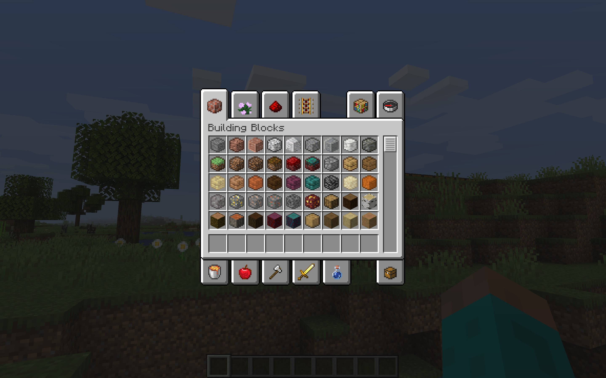
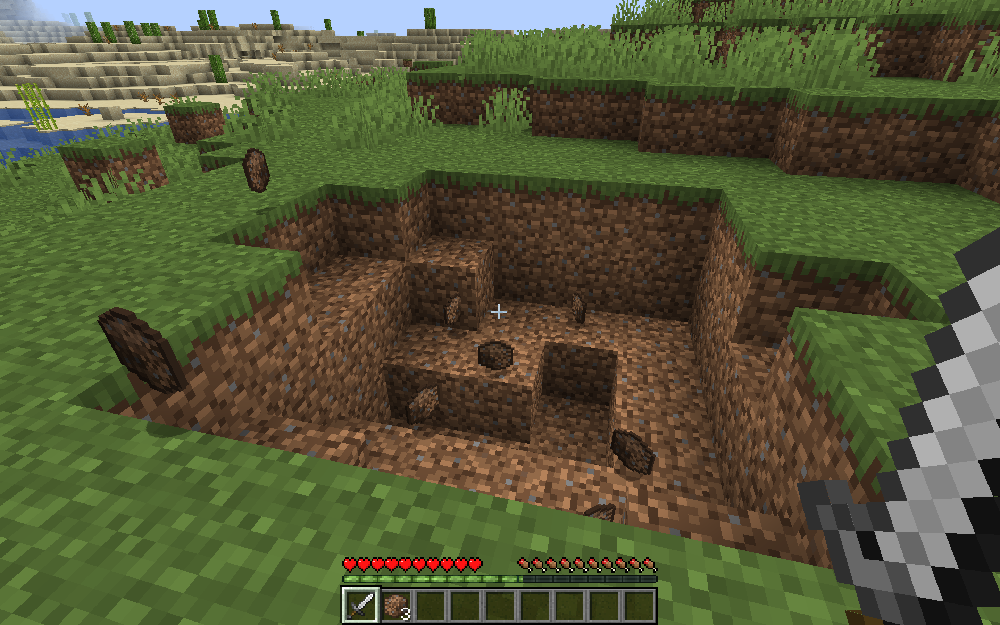
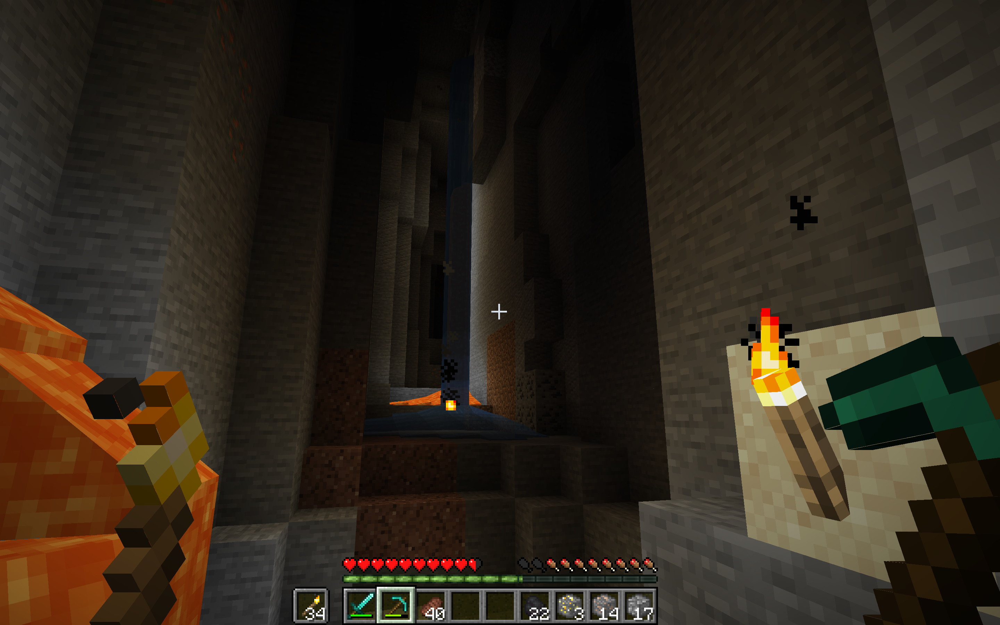
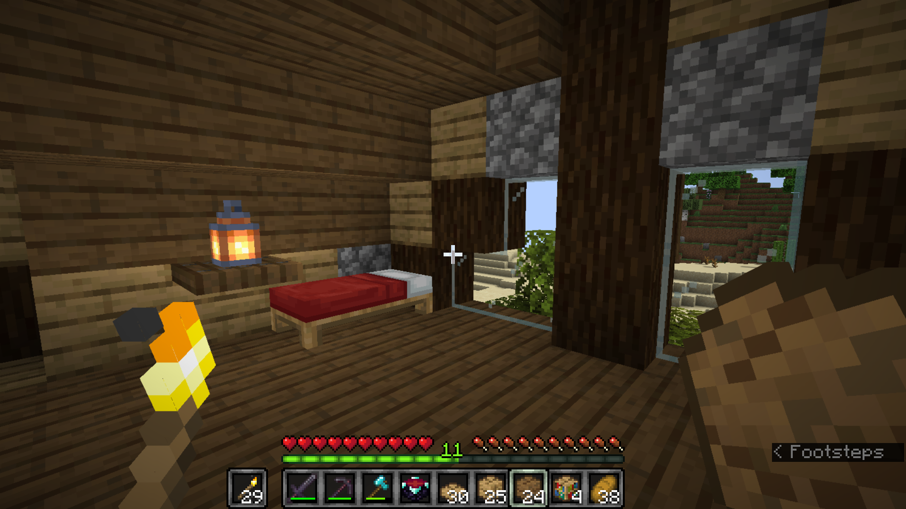
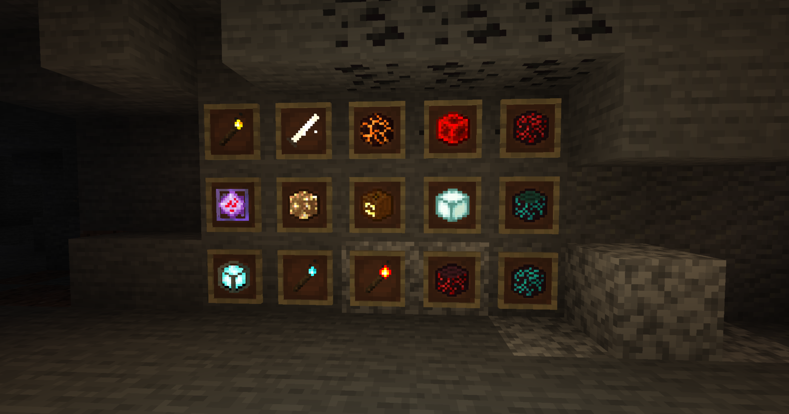
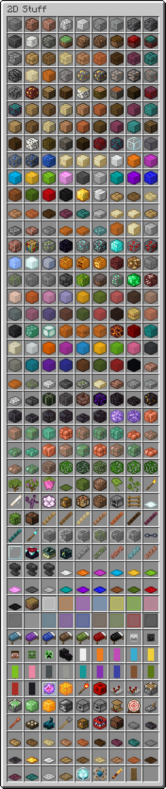

2D Block Items
==============
###### Flatten your Minecraft blocks

Replace all of those 3D inventory previews with drawn textures! Make your inventories consistent! Or just use a neat-looking pack.

Features
--------

- Mostly high-quality textures!
- The death of the third dimension*!
- Differentiation between otherwise identical blocks, like a shiny finish on the waxed copper items!
- Neat animations!
- A more cohesive visual style!

\*Death of the third dimension only available in the GUI and your hand.

Preview
-------

YouTuber TheDerpyWhale made a [comprehensive video for this pack](https://youtu.be/T9gWT26CPP8).

Here's a few shots of it in action (they may not be entirely up-to-date):

Alternatively, here's a very long list of every item in the pack:

Installation
------------

[Follow this link](https://github.com/ThePotatoKing55/2D-block-texture-pack/releases/latest) and download the latest release's file for your respective Minecraft version under `Assets`. Just put it in your `resourcepacks` folder (`%AppData%\.minecraft\resourcepacks` on Windows, `~/Library/Application Support/minecraft/resourcepacks` on macOS, or `~/.minecraft/resourcepacks` on Linux) and apply it in-game.

Feedback
--------

If you find any issues or have suggestions, make a new issue [here](https://github.com/ThePotatoKing55/2D-block-texture-pack/issues).

Other Stuff
-----------

[Check this out on Planet Minecraft!](https://www.planetminecraft.com/texture-pack/2d-block-items/)

Shoutout to stiw91's [Flat - 2D Items](https://www.planetminecraft.com/texture-pack/flat-4806298/), which inspired me to make this pack in the first place.