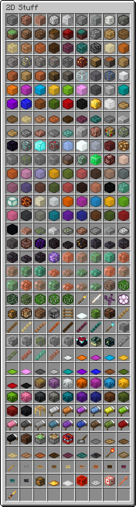

2D Block Items
==============
###### Flatten your Minecraft blocks

Replace all of those 3D inventory previews with drawn textures! Make your inventories consistent! Or just use a neat-looking pack.

Installation
------------

Download the latest release from [here](https://github.com/ThePotatoKing55/2D-block-texture-pack/releases), then put it in your `resourcepacks` folder (either at `\\%AppData%\\.minecraft\\resourcepacks\\` or `~/Library/Application Support/minecraft/resourcepacks`) and apply it in-game.

Feedback
--------

If you find any issues or have suggestions, make a new issue [here](https://github.com/ThePotatoKing55/2D-block-texture-pack/issues).

